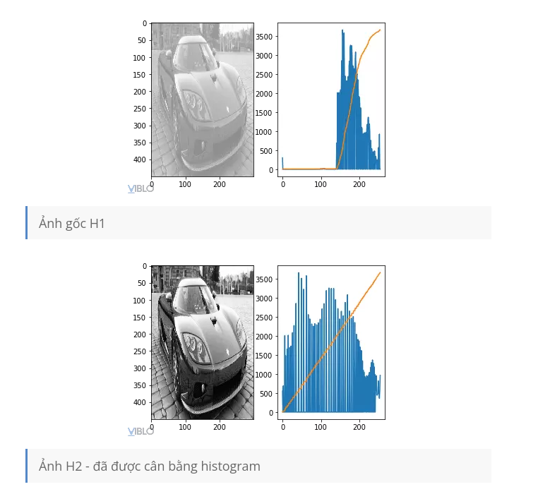
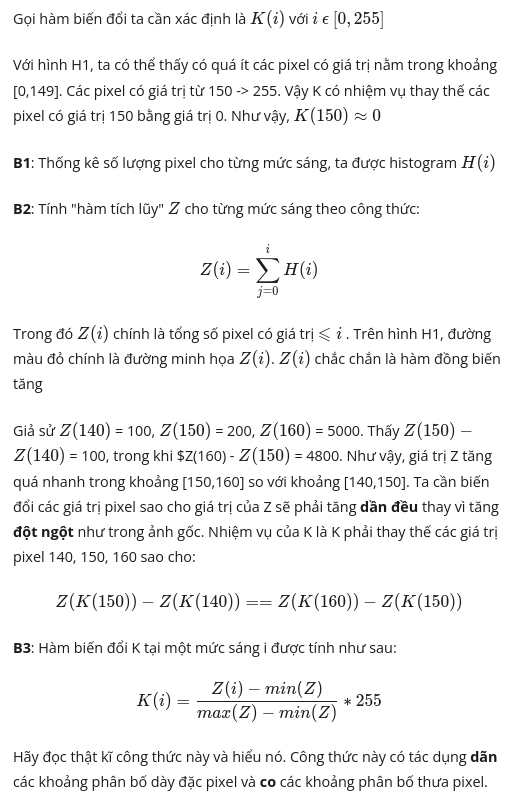

# Image Processing (Chapter 2.1)

Xử lý ảnh cung cấp các nền tảng về cách máy tính hiểu, thao tác và biến đổi dữ liệu hình ảnh, vốn là bước chuẩn bị quan trọng trong các hệ thống xác thực sinh trắc học. 

## Biểu diễn ảnh số (Digital Image Representaion)

Ma trận điểm ảnh: Máy tính nhìn nhận hình ảnh như một ma trận các điểm ảnh (pixels). Một ảnh kích thước `NxM` sẽ là một ma trận tương ứng, trong đó mỗi pixel mang một giá trị cường độ.

Cường độ điểm ảnh: Mỗi pixel có một giá trị cường độ (intensity). Với ảnh xám (grayscale), giá trị này thường nằm trong khoảng 0 (đen) đến 255 (trắng). *(tương đương 8 bit)*

-  Các lọai ảnh chính:
	- Ảnh nhị phân (Binary): Mỗi pixel chỉ có 2 giá trị {0,1} tương ứng với 1 bit.
	- Ảnh xám (Gray): Cường độ pixel nằm trong khoảng (8bits/1byte), với 0 là đen và 255 là trắng.
	- Ảnh màu: Thường biểu diện trong không gian RGB (3 bytes mỗi pixel), ngoài ra còn các không gian màu khác như HSV, Lab, YUV.

### Hue, Saturation và Value (HSV) (IMPORTANT)

Trong hệ màu, Hue, Saturation và Value (HSV) là ba thuộc tinh cơ bản giúp chúng ta phân loại và mô tả chính xác bất kì màu sắc nào.
- Hue (Sắc độ/Tông màu): Đây là màu sắc thực tế mà mắt bạn có thể nhìn thấy.
- Saturation (Độ bão hòa): Đo lường độ tinh khiết, độ đậm nhạt hay mức độ rực rỡ của màu đó.
- Value (Độ sáng): Đo lường dộ sáng hoặc độ tối của màu sắc. Ở Value thấp nhất, màu sẽ trở thành màu đen tuyền; khi tăng Value lên mức cao nhất, màu sẽ đạt độ sáng tối đa.

---

Việc sử dụng giải màu HSV mang lại nhiều điểm quan trọng trong xử lý ảnh và nhận dạng so với giải màu RGB truyền thống:
- Tách biệt thông màu sắc và cường độ sáng
- Có ý nghĩa về mặt tri giác (Perceptually meaningful): Các chiều của HSV tương ứng chặt chẽ với cách con người cảm nhận màu sắc, giúp đại diện và lựa chọn màu sắc trở nên trực quan hơn.
- Ít nhạy cảm với điều kiện ánh sáng: Vì thông tin về màu sắc (Hue) tách biệt với cường độ ánh sáng (Value), việc sử dụng một khoảng giá trị Hue để xác định đối tượng sẽ độc lập với điều kiện chiếu sáng.
- Hữu ích cho phân đoạn và nhận dạng: HSV là giải màu cực kì hiệu quả 
- Bảo toàn cân bằng màu sắc khi tăng cường chất lượng ảnh: Khi thực hiện các kỹ thuật như cân bằng lược đồ xám (*histogram equalization*) để tăng độ tương phản, giải màu HSV được khuyến khích sử dụng. Có thể áp dụng thuật toán này chỉ trên kênh Value (cường độ) rồi chuyển ngược về RGB, giúp cải thiện độ sáng mà không làm thay đổi hay làm sai lệch cân bằng màu sắc của ảnh gốc.

## Các phép biến đổi ảnh (Point Processing)

Đây là các phép biến đổi cô lập (isolated), nghĩa là giá trị pixel mới chỉ phụ thuộc vào chính giá trị của nó tại vị trí đó mà không phụ thuộc vào các pixel lân cận.

**Ứng dụng**: Tăng cường độ tương phản, cân bằng lược đồ xám (**histogram equalization**) và đặc biệt là phân ngưỡng (**thresholding**) để chuyển ảnh xám sang ảnh nhị phân dựa trên một giá trị ngưỡng (t).

### Histogram Equalization

Histogram euqalizaition (*cân bằng lược đồ xám*) là một kỹ thuật thuộc nhóm xử lý điểm ảnh (point processing) được sử dụng để tăng cường độ tương phản của hình ảnh.

#### Mục tiêu và kết quả

- **Mục tiêu**: Cải thiện độ tương phản của những hình ảnh có dải giá trị cường độ sáng quá hẹp (ảnh bị mờ, tối hoặc quá sáng) để các dối tượng trong ảnh trở nên dễ phân biệt hơn.
- **Kết quả**: Biến đổi lược đồ xám của ảnh đầu vào thành một lược đồ xám mục tiêu có phấn phối đồng nhất (uniform distribution). Điều này có nghĩa là mỗi mức xám trong ảnh sau khi xử lý sẽ xuất hiện với tần suất gần như tương đương nhau.

#### Nguyên lý hoạt động

Kỹ thuật này dựa trên hàm phân phối tích lũy (Cumulative Distribution Function - CDF). Về mặt toán học, giá trị mức xám mới (`s`) được tính toán từ mức xám cũ (`r`) thông qua một hàm biến đổi `T(r)` trong đố `s` bằng giá trị tích lũy của lược đồ xám tại mức `r` nahan với mức xám tối đa `(L - 1)`.

#### Các bước thực hiện (trong miền rời rạc) (IMPORTANT)

Quy trình thực hiện cân bằng lược đồ xám bao gồm 5 bước chính:

1. Đếm số lượng pixel (nk​) cho mỗi mức xám k trong ảnh gốc.
2. Tính lược đồ xám chuẩn hóa p(rk​) bằng cách lấy nk​ chia cho tổng số pixel của ảnh (n).
3. Tính lược đồ xám tích lũy T(k) (tổng của các giá trị p(rj​) từ mức 0 đến mức k).
4. Tính mức xám đầu ra sk​ cho từng mức k bằng cách nhân giá trị tích lũy với mức xám tối đa (thường là 255) và làm tròn kết quả.
5. Tạo ảnh đầu ra bằng cách thay thế tất cả các giá trị pixel cũ k bằng giá trị mới sk​.

## Lọc không gian và Phép cuộn (Spatial Filtering & Convolution)

- Cơ chế: Giá trị pixel mới được tính toán dựa trên giá trị của chính nó và các pixel lân cận thông qua một ma trận trọng số gọi là Kernel (hoặc Mask/Filter).
- Mục đích: 
  - Làm mịn (Smoothing/Blurring): Để khử nhiễu.
  - Làm sắc nét (Sharpening): Để làm nổi bật chi tiết.
  - Phát hiện biên (Edge detection): Sử dụng các kernel đặc thù để tìm các đường ranh giới của đối tượng.
- Vấn đề biên: Khi kernel nằm ở mép ảnh, có thể xử lý bằng cách bỏ qua, chèn thêm giá trị 0 (*zero padding*) hoặc lấy đối xứng (*reflect*).

#### Ứng dụng cho ảnh màu

Lưu ý rằng việc áp dụng cân bằng lược đồ xám riêng biệt trên ba kênh RGB là không được khuyến khích vì nó sẽ làm thay đổi nghiêm trọng sự cân bằng màu sắc ảnh.

**Phương pháp được đề xuất là:**
- Chuyển đổi ảnh sang các không gian màu khác như **Lab** hoặc **HSV/HSL**.
- Áp dụng cân bằng lược đồ xá  hcir trên kênh độ sáng.
- Chuyển đổi ảnh ngược lịa về không gian màu RGB.

> Cân bằng lược đồ xám là một hàm tự động và không có tham số điều chỉnh ngoài (OpenCV sử dụng hàm  `cv2.equalizeHist`)

> Nếu thực hiện trên cùng một bức ảnh nhưng có các độ tương phản khác nhau, kỹ thuật này thường sẽ cho ra cùng **một kết quả duy nhất**.

#### Hạn chế (IMPORTANT)

Không phải lúc nào cân bằng lược đồ xám (histogram equalization) cũng tốt. Mặc dù đây là kỹ thuật mạnh mẽ để tăng cường độ tonwg phản cho những ảnh có dải mức xám hẹp.
- Tạo ra hiệu ứng "bạc màu" (washed-out appearance): Đối với một số hình ảnh, việc cố gắng đưa lược đồ xám về phân phối đồng nhất có thể khiến hình ảnh trông không tự nhiên. Một ví dụ điển hình trong tài liệu là ảnh vệ tinh của mặt trăng Phobos; sau khi thực hiện sẽ xuất hiện hiệu ứng bạc màu, mất đi chiều sâu và chi tiết vốn có của bề mặt.
- Làm sai lệch sự cân bằng màu sắc: Nếu áp dụng cân bằng lược đồ xám riêng biệt trên kênh màu RGB, nó dẫn đến sự thay đổi nghiêm trọng về cân bằng màu sắc.
- Tăng cường nhiễu: Vì kỹ thuật này dàn trải các mức xám, nó có thể vô tình làm nổi bật các điểm nhiễu trong các vùng có độ tương phản thấp, khiến nhiễu trở nên rõ rệt hơn.

=> Tóm lại, cân bằng lược đồ xám hữu ích nhất cho các ảnh có độ tương phản thấp (low contrast). Nhưng cần cẩn trọng khi áp dụng cho ảnh màu hoặc các ảnh cần giữ nguyên đặc tính độ sáng tự nhiên.

## Các phép toán số học và Logic trong ảnh

- Phép toán số học: 
  - Cộng ảnh: Để chồng các hình ảnh. Giá trị kết quả được giới hạn tối đa là 255: `R(x,y) = Min(f(x,y) + g(x,y); 255)`.
  - Trừ ảnh: Rất quan trọng để **phát hiện chuyển động** hoặc sự thay đổi giữa hai khung hình.
  - Nhân ảnh: Dùng để thay đổi độ sáng hoặc độ tương phản bằng một tỉ lệ (ratio) nhất định.
- Phép toán logic: Sử dụng cấc phép **AND**, **OR** kết hợp với mặt nạ (mask) để trích xuất hoặc đánh dấu vùng quan tâm (Region of Interest - ROI).

## Xử lý hình thái học (Morphological Operations)

Đây là các phép toán dựa trên hình dạng của đối tượng, sử dụng **một phần tử cấu trúc** (**structuring elemenet**) để quét qua ảnh nhị phân:

- Dilation (Giãn): Mở rộng các thành phân liên thông, làm đầy các lỗ hổng và phát triển các đặc trưng.
- Erosion (Co): Thu nhỏ các đặc trưng, laoij bỏ các nhánh nhỏ, cầu nối hoặc nhiễu.
- Các phép toán kết hợp khác bao gồm Opening (mở) và Closing (đóng).
