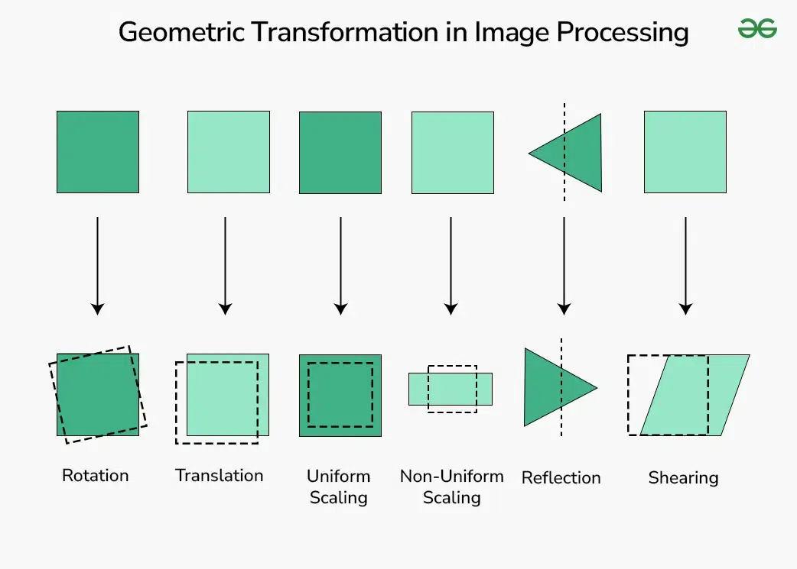

# Image Transform (Chapter 2.2)

Biến đổi ảnh (**Image Transform**), chủ yếu đề cập đến Biến đổi Fourier, là quá trình chuyển đổi hình ảnh từ miền không gian (Spatial domain) sang miền tần số (Frequency domain) để phân tích và xử lý.

##  Khái niệm Tần số trong ảnh

Trong xử lý ảnh, tần số đại diện cho mức độ thay đổi cường độ sáng giữa các điểm ảnh:
  - Tần số thấp (Low frequency): Ứng với các vùng có cường độ thay đổi chậm, các vùng đồng nhất hoặc bị mờ. Phần lớn năng lượng của ảnh tập trung ở dải tần số anyf.
  - Tần số cao (High frequency): Ứng với các vùng có cường độ thay đổi nhanh và đột ngột như các đường biên (***edges***), đường bao (***contours***) hoặc nhiễu (***noise***).

## Biến đổi Fourier

Đây là phép toán nền tảng dùng để phân tách hình ảnh thành các thành phần tần số.
- Cơ chế: Phân tách hàm phụ thuộc không gian (ảnh gốc) thành các hàm phụ thuộc vào tần số không gian. Đối với ảnh số, ta sử dụng Biến đổi Fourier rời rạc (DFT - Discrete Fourier Transform).
- Biểu diễn:  Kết quả của biến đổi Fourier là một số phức gồm phần thực và phần ảo: `F(u,v) = R(u,v) + i*I(u,v)`.
- Dịch chuyển tâm: Điểm tần số (0,0) thường được chuyển vào trung tâm của ảnh phổ để dễ dàng quan sát và lọc.

> Biến đổi Fourier (Fourier Transform) là một phép toán chuyển đổi tín hiệu hoặc hàm số miền thời gian (hoặc không gian) sang miền tần số.

## Ưu điểm của xử lý trong miền tần số

Một trong những lý do quan trọng nhất để sử dụng biến đổi ảnh là Định lý cuộn (Convolution Theorem): 
  - Phép toán Cuộn (Convolution) phức tạp trong miền không gian sẽ trở thành phép toán Nhân (Multiplication) đơn giản trong miền tần số. Điều này giúp tăng tốc độ tính toán cho các bộ lọc có kích thước lớn.

> "Định lý cuộn" là một nguyên lý toán học nền tảng, phát biểu rằng phép tích chập (convolution) của hai hàm số trong miền thời gian (hoặc không gian) sẽ tương đương phép nhân thông thường của các biến đổi Fourier của chúng trong miền tần số.

## Các bộ lọc phổ biến trong miền tần số

Quá trình lọc ảnh bao gồm: Biến đổi ảnh sang miền tần số -> Nhân với hàm lọc `H(u,v)` -> Biến đổi ngược (Inverse FFT) để về lại miền không gina

- Bộ lọc thông thấp (Low-pass filter): Giữ lại các tần số thấp và loại bỏ tần số cao.
  - **Mục đích**: Làm mịn ảnh, làm mờ ảnh và khử nhiễu.
  - **Lưu ý**: Các bộ lọc lý tưởng có thể gây ra hiện tượng "gợn sóng" (ringing) ở biên; bộ lọc Gaussian thường được dùng để tránh lỗi này.
- Bộ lọc thông cao (High-pass filter): Giữ lại các tần số cao và loại bỏ tần số thấp. Với mục đích là *phát hiện biên*, *làm sắc nét ảnh* và *làm nổi bật các chi tiết nhỏ*.
- Bộ lọc thông dài (Band-pass filter): Chỉ giữ lại các tần số trong một khoảng nhất định, có thể tạo ra bằng cách kết hợp bộ lọc thông thấp và thông cao.

## Ứng dụng thực tế

Biến đổi Fourier được ứng dụng mạnh mẽ trọng việc:
- Khử nhiễu định kỳ: Loại bỏ các nhiễu có dạng sóng *sin* lặp lại trên ảnh bằng cách xóa các điểm sáng bất thường trong phổ tần số.
- Nén ảnh: Giảm dung lượng dữ liệu bằng cách loại bỏ các thành phần tần số không quan trọng.
- Trích xuất đặc trưng: Phân tích cấu trúc bề mặt (texture) hoặc các điểm đặc trưng của đối tượng sinh trắc học.
