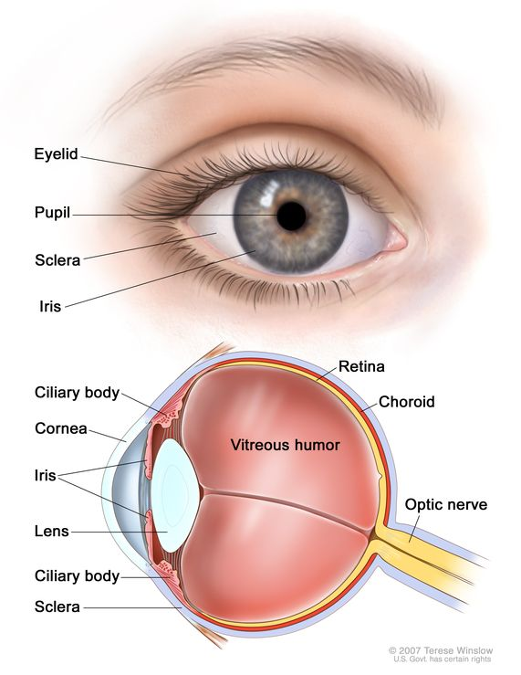

# Iris

Nhận dạng mống mắt được đánh giá là phương thức sinh trắc học chính xác nhất hiện nay nhờ vào cấu trúc phức tạp và độc nhất của nó.

## Đặc điểm sinh học và Cấu tạo

- Mống mắt là gì: Là cấu trúc có màu nằm trong vùng hình nhẫn của mắt, bao quanh đồng tử.
- Cấu trúc đa lớp: Mống mắt gồm 4 lớp chính: lớp sau (ngăn ánh sáng), lớp cơ (co giãn dổng tử), lớp đệm (stromal - chứa các mô liên kết và mạch máu) và lớp biên trước.
- Các vùng đặc trưng:  Bao gồm vùng đồng tử (pupillary zone), vùng mi (ciliary zone), nếp gấp (collarette) và các rãnh co thắt (contraction furrows).

## Tại sao mống mắt lại ưu việt

- Tính duy nhất: Các mẫu hoa văn trên mống mắt là độc nhất cho mỗi cá nhân và không phụ thuộc vào di truyền (ngay cả mắt trái và mắt phải của cùng một người hoặc mắt của các cặp song sinh cũng khác nhau).
- TÍnh ổn định: Không thay đổi từ lúc sinh ra.
- Độ tin cậy cao: Tỉ lệ nhận dạng sai cực thấp (khoảng 1/1,200,000), cao hơn nhiều so với vân tay hay khuôn mặt.
- Mật khẩu sống: Không thể bị quên, bị mất hay sao chép, và rất khó để thay dổi bằng phẫu thuật.

## Quy trình của hệ thống nhận dạng mống mắt

Hệ thống hoạt động theo 5 bước chính:

- Thu nhận ảnh: Chụp ảnh mắt độ phân giải cao. Sử dụng kênh cận hồng ngoại (NIR) đặc biệt có lợi để làm rõ cấu trúc của mống mắt màu tối.
- Phân đoạn (Segmentation): Xác đinh ranh giới giữa mống mắt/củng mạc và mống mắt/đồng tử bằng các thuật toán như Biến đổi Hough tròn.
- Chuẩn hóa (Normalization): Chuyển đổi cùng mống mắt từ hình nhẫn sang dạng chữ nhật (tọa độ cực) để có kích thước cố định, giúp việc so sánh dễ dàng hơn bất kể sự co giãn của đồng tử.
- Mã hóa đặc trưng (Feature Encoding): Sử dụng bộ lọc Gabor để trích xuất thông tin pha và mã hóa thành một chuỗi nhị phân gọi là **Iris Code**.
- So khớp (Matching): Sử dụng phép đo khoảng cách Hamming.